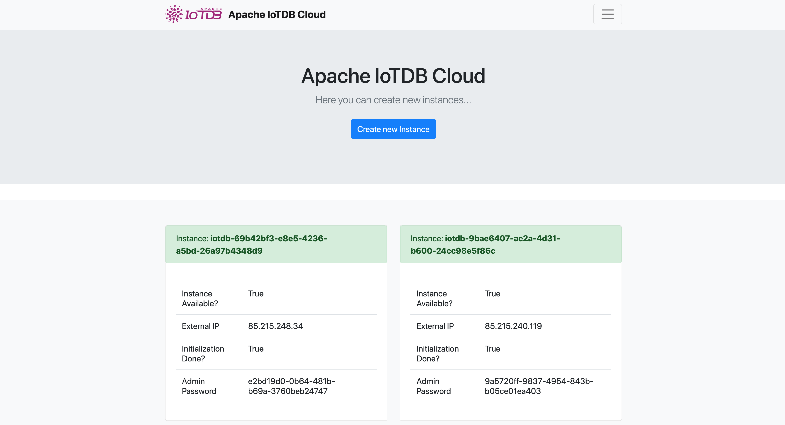

# IoTDB Cloud

This is a proof of concept for a self service hosted IoTDB Cloud Solution.
The basic Idea is to get a Service like MongoDBs Atlas but for timeseries based on IoTDB.

## Functionality

## Look and Feel

## Roadmap

- [X] First prototyp
- [ ] User Login
- [ ] Rich Settings for Instance creation
- [ ] Move Async Tasks to Celery
- [ ] Limit Demo Accounts for Users
- [ ] Send Email when instance is ready